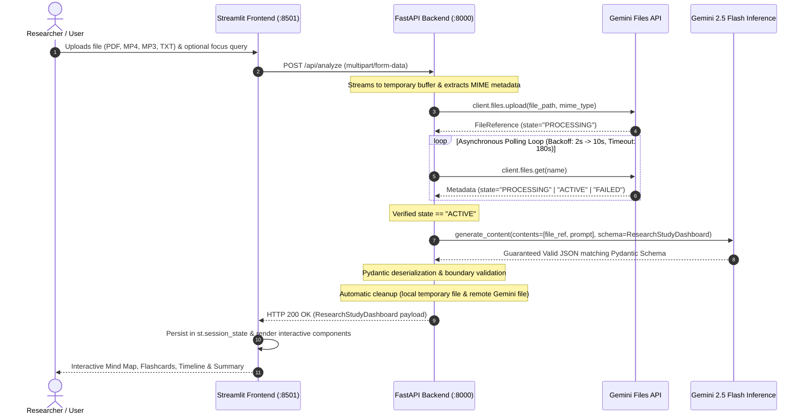

# 🔬 Multimodal Deep Researcher

> **Autonomous Multimodal Intelligence Synthesizer & Knowledge Architect**  
> *Built with Python 3.12+, FastAPI, Google Gemini 2.5 Flash (`google-genai`), Pydantic v2, PyVis, and Streamlit.*

[](https://www.python.org/)
[](https://fastapi.tiangolo.com/)
[](https://github.com/googleapis/python-genai)
[](https://docs.pydantic.dev/)
[](https://streamlit.io/)
[](https://pytest.org/)

---

## 📑 Table of Contents

1. [Executive Summary & Architectural Overview](#-executive-summary--architectural-overview)
2. [End-to-End System Topology & Data Flow](#-end-to-end-system-topology--data-flow)
3. [Engineering Invariants & Rulebook](#-engineering-invariants--rulebook)
4. [Domain Schemas & Pydantic Data Models](#-domain-schemas--pydantic-data-models)
5. [Repository Structure](#-repository-structure)
6. [Prerequisites & Environment Setup](#-prerequisites--environment-setup)
7. [Running the Application (Microservices Architecture)](#-running-the-application-microservices-architecture)
8. [API Specification & CLI Usage](#-api-specification--cli-usage)
9. [Automated Test Suite & Quality Assurance](#-automated-test-suite--quality-assurance)
10. [Troubleshooting & Operational FAQ](#-troubleshooting--operational-faq)

---

## 🏛 Executive Summary & Architectural Overview

Dense multimodal academic materials—such as 60-page research manuscripts, two-hour video symposiums, technical podcasts, and complex system diagrams—require immense cognitive overhead to digest, connect, and verify.

**Multimodal Deep Researcher** is an asynchronous intelligence extraction engine that ingests unstructured multimodal streams and decomposes them into four structured, interactive analytical artifacts:

1. **🧠 Interactive Knowledge Graph (Mind Map):** A force-directed topological network of concepts, methodologies, and empirical findings connected by directed, semantically labeled relationships (`causes`, `theoretically contradicts`, `empirically validates`).
2. **🗂️ Active-Recall Flashcard Deck:** Spaced-repetition study units equipped with question, synthesized answer, assessed cognitive difficulty (`easy`, `medium`, `hard`), topic taxonomy, and exact source citations (page numbers, section titles, or video timestamps).
3. **⏳ Chronological & Phase Milestones (Timeline):** Sequential progression of historical milestones, breakthrough discoveries, and experimental phases with quantified significance assessments.
4. **📑 Executive Intelligence Summary:** High-impact findings, core theses, and takeaways.

The system is structured as a decoupled two-tier microservice architecture: an asynchronous **FastAPI** backend handling ingestion and Gemini orchestration, paired with a modern reactive **Streamlit** frontend.

---

## 🔄 End-to-End System Topology & Data Flow



### Key Workflow Phases

1. **Ingestion & Streaming:** The client uploads files up to several gigabytes via the Streamlit sidebar. The stream is forwarded to the FastAPI backend at `/api/analyze`.
2. **Gemini Ingestion & Asynchronous Polling:** The file is registered with the Google Gemini Files API. Because video, audio, and large document parsing involves remote optical and acoustic ingestion, the backend executes an asynchronous polling loop with exponential backoff, holding generation until the file enters the `ACTIVE` state.
3. **Structured Generation:** Inference is executed against `gemini-3.6-flash` using `GenerateContentConfig(response_mime_type="application/json", response_schema=ResearchStudyDashboard)`. The model is guided by an academic synthesizer system prompt to extract deep causal relationships rather than superficial summaries.
4. **Resource Sanitization:** On completion or failure, the backend cleans up both the local temporary disk buffer and the remote Gemini Files resource (`client.files.delete`).
5. **Interactive Visualization:** The frontend stores the validated payload in `st.session_state` and renders force-directed physics graphs via **PyVis**, active-recall flashcards with flip expanders, and vertical timeline trees.

---

## 📐 Engineering Invariants & Rulebook

All components strictly comply with the architectural guidelines codified in [`docs/00_agent_rules.md`](file:///c:/GIEREK/pythonPrograms/DeepResearcherAI/docs/00_agent_rules.md):

* **Modern SDK Standard:** Mandatory use of the official unified **`google-genai`** SDK (`from google import genai`, `from google.genai import types`). Legacy packages (`google-generativeai`) are strictly forbidden across the codebase.
* **Deterministic Structured Outputs:** Gemini generation enforces Pydantic schemas passed directly to `response_schema`. Raw string extraction, markdown regex scraping, or unvalidated dictionaries are strictly forbidden.
* **Modern Python 3.12+ Typing:** Comprehensive type hinting (`X | None`, builtin generics `list[T]`, `dict[K, V]`, `typing.Annotated`).
* **Absolute Tier Decoupling:** The backend service has zero knowledge of Streamlit or presentation logic. The frontend performs zero direct SDK or LLM calls, communicating solely over HTTP/REST.
* **Rate-Limit Resilience:** The Gemini engine wraps generation in an exponential backoff loop with jitter, handling HTTP 429 quota exhaustion gracefully before raising errors.

---

## 📦 Domain Schemas & Pydantic Data Models

The data structures defined in [`src/backend/schemas/dashboard.py`](file:///c:/GIEREK/pythonPrograms/DeepResearcherAI/src/backend/schemas/dashboard.py) govern LLM generation and API boundaries:

```python
class MindMapNode(BaseModel):
    id: str = Field(..., description="Unique alphanumeric identifier for the node.")
    label: str = Field(..., description="Concise title or name of the conceptual node.")
    description: str = Field(..., description="Detailed explanation or definition.")
    category: str = Field(default="concept", description="Classification (core_concept, methodology, finding, hardware).")
    importance: int = Field(default=3, ge=1, le=5, description="Significance hierarchy level (1=leaf, 5=central core).")

class MindMapEdge(BaseModel):
    source: str = Field(..., description="ID of source MindMapNode.")
    target: str = Field(..., description="ID of target MindMapNode.")
    relationship: str = Field(..., description="Description of relationship (e.g., 'empirically validates', 'causes').")

class Flashcard(BaseModel):
    id: str = Field(..., description="Unique identifier for the flashcard.")
    question: str = Field(..., description="Targeted conceptual question testing comprehension.")
    answer: str = Field(..., description="Accurate, complete synthesized answer.")
    difficulty: Literal["easy", "medium", "hard"] = Field(default="medium")
    topic: str = Field(..., description="Subject domain tag.")
    source_reference: str | None = Field(default=None, description="Citation, section, or timestamp.")

class TimelineEvent(BaseModel):
    id: str = Field(..., description="Unique identifier for the milestone.")
    date_or_period: str = Field(..., description="Calendar date, historical era, or sequential timestamp.")
    title: str = Field(..., description="Short descriptive headline of the milestone.")
    summary: str = Field(..., description="Detailed contextual summary of what transpired.")
    significance: str = Field(..., description="Analytical assessment of domain impact.")
    sources: list[str] = Field(default_factory=list, description="Corroborating source references.")

class ResearchStudyDashboard(BaseModel):
    title: str = Field(..., description="Synthesized research report title.")
    executive_summary: str = Field(..., description="Thorough executive summary.")
    key_findings: list[str] = Field(default_factory=list, description="High-impact takeaways.")
    nodes: list[MindMapNode] = Field(default_factory=list)
    edges: list[MindMapEdge] = Field(default_factory=list)
    flashcards: list[Flashcard] = Field(default_factory=list)
    timeline: list[TimelineEvent] = Field(default_factory=list)
```

---

## 🗂 Repository Structure

```
DeepResearcherAI/
│
├── .env.example                     # Environment template (GEMINI_API_KEY, host, port)
├── .gitignore                       # Production-grade ignore rules (caches, keys, temp files)
├── README.md                        # Master architectural blueprint & user manual
├── requirements.txt                 # Unified dependencies (backend, frontend, testing)
│
├── docs/                            # Formal architectural documentation
│   ├── 00_agent_rules.md            # Mandatory engineering standards and SDK guidelines
│   ├── 01_architecture_spec.md      # System specification, data flow & data models
│   ├── 02_api_specification.md      # API contract, MIME types, error codes & curl recipes
│   └── 03_frontend_spec.md          # UI component architecture & visualizer specifications
│
├── src/                             # Source code
│   ├── backend/                     # FastAPI backend microservice
│   │   ├── __init__.py
│   │   ├── config.py                # Pydantic BaseSettings environment validation
│   │   ├── main.py                  # ASGI server, CORS, /health and /api/analyze routes
│   │   ├── schemas/                 # Data contracts
│   │   │   ├── __init__.py
│   │   │   └── dashboard.py         # Complete Pydantic domain models
│   │   └── services/                # Core domain logic
│   │       ├── __init__.py
│   │       ├── file_service.py      # Gemini Files API upload, async polling, and cleanup
│   │       └── gemini_service.py    # Structured generation with 429 rate limit backoff
│   │
│   └── frontend/                    # Streamlit presentation microservice
│       ├── __init__.py
│       ├── app.py                   # Main reactive dashboard, file uploader, state retention
│       └── components/              # Interactive rendering modules
│           ├── __init__.py
│           └── visualizers.py       # PyVis Knowledge Graph, Flashcards, and Timeline
│
└── tests/                           # Complete test suite (100% offline with mocks)
    ├── backend/
    │   ├── __init__.py
    │   ├── test_api.py              # FastAPI TestClient endpoint integration tests
    │   ├── test_config.py           # Configuration validation tests
    │   ├── test_file_service.py     # Polling loop, timeout, and failure state tests
    │   ├── test_gemini_service.py   # Rate-limiting, backoff retries, and schema tests
    │   └── test_schemas.py          # Pydantic boundary validation & JSON schema export
    └── frontend/
        ├── __init__.py
        └── test_visualizers.py      # PyVis network builder and card renderer tests
```

---

## ⚡ Prerequisites & Environment Setup

### 1. System Prerequisites
* **Python 3.12+** (tested and verified on Python 3.12 and 3.13).
* A valid **Google Gemini API Key** (obtainable via [Google AI Studio](https://aistudio.google.com/)).

### 2. Clone & Virtual Environment
```bash
# Clone repository
git clone https://github.com/dawidnaessie/DeepResearcherAI.git
cd DeepResearcherAI

# Create virtual environment
python -m venv venv

# Activate virtual environment
# On Windows (PowerShell):
.\venv\Scripts\Activate.ps1
# On Linux / macOS:
source venv/bin/activate
```

### 3. Install Dependencies
```bash
pip install -r requirements.txt
```

### 4. Configure Environment Secrets
Create a `.env` file in the project root:
```bash
cp .env.example .env
```
Edit `.env` and provide your Gemini API key:
```ini
GEMINI_API_KEY=AIzaSyYourActualGeminiApiKeyHere
BACKEND_HOST=0.0.0.0
BACKEND_PORT=8000
```

---

## 🚀 Running the Application (Microservices Architecture)

The system operates as two concurrent services. Open **two separate terminal windows**:

### Terminal 1: Launch FastAPI Backend
```bash
python -m uvicorn src.backend.main:app --reload --port 8000
```
* **API Service:** `http://localhost:8000`
* **Swagger Interactive Docs:** `http://localhost:8000/docs`
* **Health Check Probe:** `http://localhost:8000/health`

### Terminal 2: Launch Streamlit Frontend
```bash
python -m streamlit run src/frontend/app.py
```
* **User Interface:** `http://localhost:8501`

---

## 📡 API Specification & CLI Usage

### Supported Multimodal Formats
* **Documents:** `.pdf`, `.txt`, `.md`, `.csv` (`application/pdf`, `text/plain`, etc.)
* **Audio:** `.mp3`, `.wav`, `.m4a` (`audio/mp3`, `audio/mpeg`, etc.)
* **Video:** `.mp4`, `.mov`, `.webm` (`video/mp4`, `video/quicktime`, etc.)
* **Images:** `.png`, `.jpg`, `.jpeg`, `.webp` (`image/png`, `image/jpeg`, etc.)

### Health Check (`GET /health`)
```bash
curl -X GET "http://localhost:8000/health"
```
**Response (200 OK):**
```json
{
  "status": "healthy",
  "service": "Multimodal Deep Researcher API",
  "version": "1.0.0"
}
```

### Analyze Document via Curl (`POST /api/analyze`)
```bash
curl -X POST "http://localhost:8000/api/analyze" \
  -H "Accept: application/json" \
  -F "file=@./research_paper.pdf;type=application/pdf" \
  -F "prompt=Focus on quantum error correction thresholds and physical gate fidelities."
```

### Analyze Audio Lecture via Curl (`POST /api/analyze`)
```bash
curl -X POST "http://localhost:8000/api/analyze" \
  -H "Accept: application/json" \
  -F "file=@./neuroscience_lecture.mp3;type=audio/mp3" \
  -F "prompt=Extract all chronological breakthroughs mentioned in the lecture."
```

---

## 🧪 Automated Test Suite & Quality Assurance

The test suite runs **100% offline** without network dependencies by mocking out the Gemini Files API and generation endpoints with deterministic fixtures.

### Execute All Tests
```bash
python -m pytest tests/ -v
```

### Verified Coverage Metrics
```text
============================= test session starts =============================
platform win32 -- Python 3.13.14, pytest-9.1.1, pluggy-1.6.0
rootdir: C:\GIEREK\pythonPrograms\DeepResearcherAI
plugins: anyio-4.14.2, asyncio-1.4.0
collected 28 items

tests/backend/test_api.py::test_health_check_endpoint PASSED             [  3%]
tests/backend/test_api.py::test_analyze_endpoint_success PASSED          [  7%]
tests/backend/test_api.py::test_analyze_endpoint_gemini_timeout PASSED   [ 10%]
tests/backend/test_api.py::test_analyze_endpoint_file_processing_error PASSED [ 14%]
tests/backend/test_api.py::test_analyze_endpoint_rate_limit PASSED       [ 17%]
tests/backend/test_config.py::test_default_settings PASSED               [ 21%]
tests/backend/test_file_service.py::test_upload_file_not_found PASSED    [ 25%]
tests/backend/test_file_service.py::test_upload_already_active PASSED    [ 28%]
tests/backend/test_file_service.py::test_upload_polling_transitions_to_active PASSED [ 32%]
tests/backend/test_file_service.py::test_upload_polling_handles_failed_state PASSED [ 35%]
tests/backend/test_file_service.py::test_upload_polling_timeout PASSED   [ 39%]
tests/backend/test_file_service.py::test_delete_file PASSED              [ 42%]
tests/backend/test_gemini_service.py::test_generate_study_dashboard_success PASSED [ 46%]
tests/backend/test_gemini_service.py::test_generate_study_dashboard_retries_on_rate_limit PASSED [ 50%]
tests/backend/test_gemini_service.py::test_generate_study_dashboard_rate_limit_exhausted PASSED [ 53%]
tests/backend/test_gemini_service.py::test_generate_study_dashboard_empty_response PASSED [ 57%]
tests/backend/test_schemas.py::test_mind_map_node_instantiation PASSED   [ 60%]
tests/backend/test_schemas.py::test_mind_map_node_importance_bounds PASSED [ 64%]
tests/backend/test_schemas.py::test_mind_map_edge_instantiation PASSED   [ 67%]
tests/backend/test_schemas.py::test_flashcard_instantiation_and_difficulty PASSED [ 71%]
tests/backend/test_schemas.py::test_timeline_event_instantiation PASSED  [ 75%]
tests/backend/test_schemas.py::test_research_study_dashboard_roundtrip PASSED [ 78%]
tests/backend/test_alias_equivalence PASSED                             [ 82%]
tests/backend/test_json_schema_export_for_gemini PASSED                 [ 85%]
tests/frontend/test_visualizers.py::test_get_val_helper PASSED           [ 89%]
tests/frontend/test_visualizers.py::test_palette_mappings PASSED         [ 92%]
tests/frontend/test_visualizers.py::test_render_empty_components PASSED  [ 96%]
tests/frontend/test_visualizers.py::test_render_mind_map_construction PASSED [100%]

============================== 28 passed in 4.52s =============================
```

---

## ❓ Troubleshooting & Operational FAQ

### 1. `GeminiRateLimitError` or HTTP 429
* **Symptom:** API returns `429 Too Many Requests`.
* **Cause:** Google Gemini API project free-tier queries per minute (QPM) exceeded.
* **Remedy:** The backend automatically executes exponential backoff across 4 retry attempts. If your workload exceeds default quotas, upgrade your Google AI Studio project to Pay-As-You-Go or configure higher backoff ceilings in `src/backend/services/gemini_service.py`.

### 2. Large Video or PDF Takes Several Minutes
* **Symptom:** UI displays loading spinner for 60–120 seconds.
* **Explanation:** Large video presentations (e.g. 500MB MP4) require multi-stage server-side transcoding and audio track transcription on Gemini's infrastructure. Our polling loop safely holds until state is `ACTIVE`.
* **Configuration:** Extend `POLL_TIMEOUT_SECONDS` in `.env` (default is 180 seconds).

### 3. Frontend Shows "🔴 Backend Offline"
* **Symptom:** Warning banner appears in the sidebar.
* **Remedy:** Start the backend server in a separate terminal:
  ```bash
  python -m uvicorn src.backend.main:app --port 8000
  ```
  Verify connectivity by accessing `http://localhost:8000/health`.

---

## 📜 License

Distributed under the Apache 2.0 License. Designed and architected for high-reliability multimodal research synthesis.
