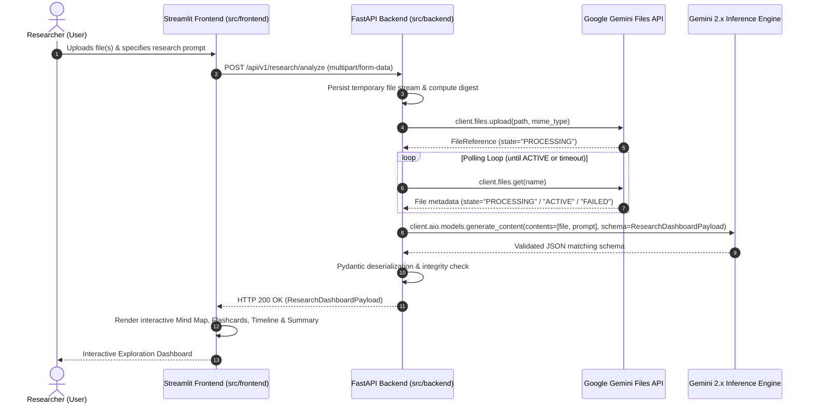

# Architecture Specification

**Project:** Multimodal Deep Researcher  
**Status:** Pre-Implementation Specification  
**Authors:** Principal AI Architect & Lead Python Engineer  

---

## 1. System Overview

The **Multimodal Deep Researcher** is an end-to-end intelligence synthesis system designed to ingest multimodal materials (academic papers, audio lectures, video recordings, high-density diagrams) and generate structured, interactive research artifacts:
* **Interactive Mind Maps:** Conceptual knowledge graphs (nodes and directional edges).
* **Flashcards:** Spaced-repetition study units with question, answer, difficulty, and source citations.
* **Timeline Events:** Chronological milestones and developmental sequences extracted from the materials.
* **Executive Synthesis:** Comprehensive summaries and key takeaways.

The architecture enforces strict decoupling between the **FastAPI Backend Service** and the **Streamlit Presentation Layer**, with all AI extraction powered by Google Gemini via the modern **`google-genai`** SDK.

---

## 2. End-to-End Data Flow



### 2.1 Step-by-Step Lifecycle

1. **User Ingestion (Frontend):**
   * The user uploads research documents (PDF, MP4, MP3, PNG, etc.) and optionally inputs a research focus query in the Streamlit UI (`src/frontend/app.py`).
2. **Backend Submission (HTTP API):**
   * The frontend streams the file to the FastAPI backend at `POST /api/v1/research/analyze` via `httpx`.
3. **Gemini Ingestion & File Processing:**
   * The backend receives the upload, stores it in a temporary buffer, and uploads it to Google Gemini using `client.files.upload()`.
4. **State Polling Verification:**
   * The backend executes an async polling loop on `client.files.get(name=...)` with exponential backoff.
   * Execution pauses until the file status transitions from `PROCESSING` to `ACTIVE`. If status becomes `FAILED`, a 500 error is returned with diagnostic details.
5. **Structured Generation (Schema Enforcement):**
   * The backend invokes `client.aio.models.generate_content()` with `types.GenerateContentConfig`:
     * `response_mime_type="application/json"`
     * `response_schema=ResearchDashboardPayload`
   * The model produces deterministic, structured JSON conforming strictly to the Pydantic schema.
6. **Validation & Response Serialization:**
   * FastAPI parses the response text directly into the `ResearchDashboardPayload` Pydantic model.
   * Returns a standard JSON payload with HTTP status 200.
7. **Frontend Visualization:**
   * Streamlit unpacks the payload:
     * Graph network visualized using `streamlit-agraph` (MindMap).
     * Interactive card flip / quiz interface for Flashcards.
     * Chronological milestone track for the Timeline.
     * Markdown summary view for executive notes.

---

## 3. Data Models (`src/backend/schemas/dashboard.py`)

The following exact Pydantic models (Python 3.12+) define the analytical entities and the top-level payload used for Gemini's `response_schema`.

```python
"""Pydantic schemas for the Research Dashboard."""

from typing import Literal
from pydantic import BaseModel, Field


class MindMapNode(BaseModel):
    """Represents an individual conceptual node in the synthesized mind map."""

    id: str = Field(
        ...,
        description="Unique identifier for the node (e.g., 'node_1', 'concept_quantum_entanglement').",
    )
    label: str = Field(
        ...,
        description="Short, human-readable title or label of the concept.",
    )
    description: str = Field(
        ...,
        description="Concise description or definition of the concept.",
    )
    category: str = Field(
        default="concept",
        description="Classification of the node (e.g., 'core_concept', 'methodology', 'finding', 'entity').",
    )
    importance: int = Field(
        default=3,
        ge=1,
        le=5,
        description="Hierarchy or importance level ranging from 1 (tertiary/leaf) to 5 (central core theme).",
    )


class MindMapEdge(BaseModel):
    """Represents a directed or associative relationship between two MindMap nodes."""

    source: str = Field(
        ...,
        description="ID of the source MindMapNode.",
    )
    target: str = Field(
        ...,
        description="ID of the target MindMapNode.",
    )
    relationship: str = Field(
        ...,
        description="Verbal description of the link (e.g., 'causes', 'supports', 'contradicts', 'derives from').",
    )


class Flashcard(BaseModel):
    """Represents a question-answer revision card derived from key material."""

    id: str = Field(
        ...,
        description="Unique identifier for the flashcard (e.g., 'fc_1').",
    )
    question: str = Field(
        ...,
        description="Targeted test question evaluating comprehension of a key insight.",
    )
    answer: str = Field(
        ...,
        description="Accurate and complete answer synthesizing findings from the source.",
    )
    difficulty: Literal["easy", "medium", "hard"] = Field(
        default="medium",
        description="Assessed difficulty level of the card.",
    )
    topic: str = Field(
        ...,
        description="Associated topic or domain module for categorization.",
    )
    source_reference: str | None = Field(
        default=None,
        description="Specific section, timestamp, page, or citation within the uploaded content.",
    )


class TimelineEvent(BaseModel):
    """Represents a chronological milestone, discovery, or sequential stage."""

    id: str = Field(
        ...,
        description="Unique identifier for the timeline event (e.g., 'event_1').",
    )
    date_or_period: str = Field(
        ...,
        description="Calendar date, historical period, timestamp, or phase identifier (e.g., '1953', '00:14:22', 'Phase II').",
    )
    title: str = Field(
        ...,
        description="Clear title summarizing the milestone.",
    )
    summary: str = Field(
        ...,
        description="Detailed contextual summary of what transpired and why it matters.",
    )
    significance: str = Field(
        ...,
        description="Analytical assessment of the event's impact on the broader domain.",
    )
    sources: list[str] = Field(
        default_factory=list,
        description="Citations, page numbers, or timestamps from the input data.",
    )


class ResearchDashboardPayload(BaseModel):
    """Root container model returned by Gemini and served via the FastAPI endpoint."""

    title: str = Field(
        ...,
        description="Synthesized research report title.",
    )
    executive_summary: str = Field(
        ...,
        description="Comprehensive analytical summary synthesizing all multimodal inputs.",
    )
    key_findings: list[str] = Field(
        default_factory=list,
        description="Bullet-point list of primary breakthroughs or conclusions.",
    )
    nodes: list[MindMapNode] = Field(
        default_factory=list,
        description="Nodes forming the conceptual knowledge network.",
    )
    edges: list[MindMapEdge] = Field(
        default_factory=list,
        description="Directed connections defining the relationship network.",
    )
    flashcards: list[Flashcard] = Field(
        default_factory=list,
        description="Curated collection of flashcards for active recall.",
    )
    timeline: list[TimelineEvent] = Field(
        default_factory=list,
        description="Chronological or sequential progression of events.",
    )
```

---

## 4. System Dependencies

### 4.1 Backend (`src/backend`)
* `fastapi>=0.115.0`: Core high-performance ASGI API framework.
* `uvicorn[standard]>=0.30.0`: Production-ready ASGI web server.
* `google-genai>=1.0.0`: Official next-generation Google Gen AI Python SDK.
* `pydantic>=2.8.0`: Boundary type validation and JSON schema synthesis.
* `pydantic-settings>=2.4.0`: Environment variable and settings management.
* `python-multipart>=0.0.9`: Fast streaming multipart form-data parsing for uploads.
* `httpx>=0.27.0`: Modern async HTTP client for external integrations and health checks.
* `python-dotenv>=1.0.0`: Local `.env` configuration loader.

### 4.2 Frontend (`src/frontend`)
* `streamlit>=1.38.0`: Reactive Python-based interactive dashboard framework.
* `httpx>=0.27.0`: Client for calling FastAPI backend endpoints.
* `streamlit-agraph>=0.0.45`: Interactive Force-Directed Graph visualization component for MindMap nodes and edges.
* `pydantic>=2.8.0`: Frontend data validation and schema integrity.

### 4.3 Development & Test Tooling
* `pytest>=8.3.0`: Test runner.
* `pytest-asyncio>=0.24.0`: Asynchronous test support for FastAPI routes and Gemini polling services.
* `ruff>=0.6.0`: Ultra-fast Python linter and code formatter.
* `mypy>=1.11.0`: Static type checking.
