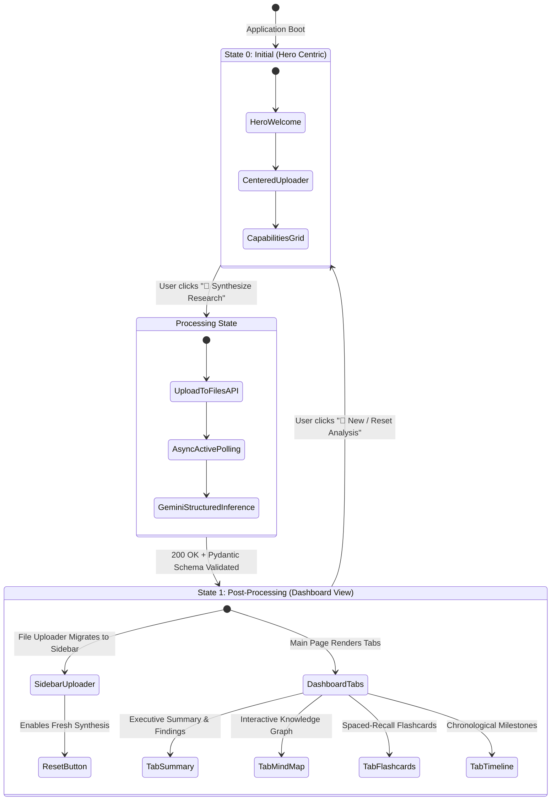

# Frontend Specification & Run Guide

**Project:** Multimodal Deep Researcher  
**Frontend Framework:** Streamlit (Python 3.12+)  
**Visualization Engine:** PyVis (Vis.js Interactive Physics Network via CDN)  
**Specification Status:** Active  

---

## 1. Architectural Philosophy

The **Multimodal Deep Researcher** frontend ([`src/frontend/app.py`](file:///c:/GIEREK/pythonPrograms/DeepResearcherAI/src/frontend/app.py)) is completely decoupled from model execution and file management. It acts as a reactive presentation client communicating with the FastAPI backend over HTTP (`multipart/form-data` uploads and strongly typed JSON responses).

```
   ┌────────────────────────────────┐
   │       Streamlit Frontend       │
   │      (src/frontend/app.py)     │
   └───────────────┬────────────────┘
                   │ HTTP POST /api/analyze (multipart)
                   │ HTTP GET  /health
                   ▼
   ┌────────────────────────────────┐
   │         FastAPI Backend        │
   │       (src/backend/main.py)    │
   └───────────────┬────────────────┘
                   │
                   ▼
   ┌────────────────────────────────┐
   │      Gemini 3.6 Flash API      │
   │   (Files API + Polling Loop)   │
   └────────────────────────────────┘
```

---

## 2. Stateful UI Layout (Adaptive Dynamic Viewports)

The user interface follows an adaptive stateful lifecycle driven by `st.session_state['has_data']`:



### 2.1 State 0 (Initial — Hero Ingestion Mode)
* **Flag:** `st.session_state['has_data'] == False`
* **Layout:** Centered, prominent Hero stage on the main viewport:
  * **Header:** Deep purple gradient banner with title `🔬 Multimodal Deep Researcher` and tagline `Autonomous Multimodal Intelligence Synthesizer & Knowledge Architect`.
  * **Primary Action Canvas:** Centered card containing `st.file_uploader` supporting PDF manuscripts, MP4 recordings, MP3 audio lectures, and TXT notes.
  * **Research Focus Input:** Optional `st.text_area` for custom focus queries, hypothesis prompts, and thematic directions.
  * **Trigger:** Vibrant, full-width `🚀 Synthesize Research` primary action button.
  * **Capability Showcase:** Clean 4-column capability cards detailing the Knowledge Graph, Active Recall Flashcards, Chronological Timeline, and Executive Summary.
  * **Sidebar:** Minimalist diagnostic panel displaying backend operational readiness (`GET /health`) and connection settings.

### 2.2 State 1 (Post-Processing — Intelligence Workspace Mode)
* **Flag:** `st.session_state['has_data'] == True`
* **Adaptive Relocation:** The file ingestion component **migrates into the left sidebar**, vacating the primary canvas to showcase analytical artifacts.
* **Sidebar Controls:**
  * Ingestion card with `st.file_uploader` and optional prompt for subsequent research uploads.
  * `🚀 Re-Synthesize` primary trigger button for continuous research workflows.
  * `🔄 New / Reset Analysis` button which clears session state and smoothly returns to State 0.
  * Dynamic backend health indicator and connection configuration expander.
* **Main Canvas (Dashboard):**
  * **Study Header:** Displays the extracted document title, original filename citation (`📄 Source: ...`), inference engine identifier (`🤖 Engine: Gemini 3.6 Flash`), and analytical metric chips (nodes, edges, flashcards, timeline events).
  * **Four Analytical Tabs:**
    1. `📑 Executive Summary`: Incisive executive narrative, thematic breakdown, and high-impact quantitative findings.
    2. `🧠 Knowledge Graph (Mind Map)`: Full-width force-directed PyVis network featuring physics stabilization, zoom/pan controls, and hover tooltips.
    3. `🗂️ Active-Recall Flashcards`: Categorized flashcards with difficulty filters (`All`, `Easy`, `Medium`, `Hard`), topic tags, and flip expanders with exact source citations.
    4. `⏳ Chronological Timeline`: Vertical chronological progression of discoveries, milestones, and phase breakdowns.

---

## 3. Thematic Design System (Deep Nebula Dark Mode)

The UI applies a deep purplish/bluish dark aesthetic engineered for readability during long academic study sessions:

### 3.1 Color Palette & Tokens
| Token | Hex Value | Role & Usage |
| :--- | :--- | :--- |
| **`primaryColor`** | `#8B5CF6` | Vibrant violet/indigo for primary action buttons, active tabs, and highlights. |
| **`backgroundColor`** | `#090D1A` | Deep nebula black/blue for the primary page background. |
| **`secondaryBackgroundColor`** | `#131C31` | Midnight slate for sidebars, card containers, and elevated surfaces. |
| **`textColor`** | `#F8FAFC` | Crisp off-white (Slate 50) for maximum typographic contrast. |
| **`accentBorder`** | `#1E293B` | Subtle slate border for containers, card dividers, and badges. |
| **`badgeCore`** | `#4F46E5` | Deep royal purple for badges, study status pills, and focus chips. |

### 3.2 Typography & Visual Hierarchy
* **Font Family:** Modern Sans-Serif (`system-ui, -apple-system, sans-serif`).
* **Visual Hierarchy:** Distinct distinction between H1 (2.1rem study titles), H2/H3 section headers, and muted monospace metadata pills (`#94A3B8`).
* **Glassmorphism & Gradients:** Subtle 135-degree linear gradients (`#1E1B4B` to `#0F172A`) for banners and callouts.

---

## 4. Visualization Components (`src/frontend/components/visualizers.py`)

| Component | Function | Description |
| :--- | :--- | :--- |
| **Knowledge Graph** | `render_mind_map(nodes, edges)` | PyVis Force-Directed network graph embedded via `st.components.v1.html`. Configured with `cdn_resources="remote"` to eliminate local asset leakage. Nodes are colored by semantic category and sized by importance hierarchy (1–5). Edges convey explicit relationships. |
| **Active Recall Flashcards** | `render_flashcards(flashcards)` | Study flashcards with difficulty badges (`🟢 Easy`, `🟡 Medium`, `🔴 Hard`), interactive difficulty filters, and click-to-expand answers with exact source citations. |
| **Chronological Timeline** | `render_timeline(timeline_events)` | Vertical chronological milestone track with date chips, event summaries, domain significance callouts, and source pills. |

---

## 5. How to Run Locally (Concurrent Microservices)

To run the complete system, open two separate terminal windows in your IDE:

### Terminal 1: Start the FastAPI Backend
```bash
python -m uvicorn src.backend.main:app --reload --port 8000
```
* **API Server:** `http://localhost:8000`
* **Swagger Documentation:** `http://localhost:8000/docs`
* **Health Probe:** `http://localhost:8000/health`

### Terminal 2: Start the Streamlit Frontend
```bash
python -m streamlit run src/frontend/app.py
```
* **Web UI:** `http://localhost:8501`

---

## 6. End-to-End User Journey

1. Open `http://localhost:8501` in your browser (Application loads in **State 0: Hero Ingestion Mode**).
2. Confirm the sidebar status indicator shows **"🟢 Backend Connected"**.
3. In the prominent centered Hero card, upload an academic document (`.pdf`), symposium video (`.mp4`), audio recording (`.mp3`), or raw notes (`.txt`).
4. (Optional) Provide research hypotheses or target questions in the **Research Focus** box.
5. Click **"🚀 Synthesize Research"**.
6. The animated spinner tracks upload, polling, and structured Gemini 3.6 Flash generation.
7. Upon successful validation, the app transitions dynamically into **State 1: Workspace Mode**:
   - The file uploader moves smoothly to the left sidebar for subsequent uploads.
   - The main screen renders the 4 interactive study tabs.
8. To begin a completely new study, click **"🔄 New / Reset Analysis"** in the sidebar to return to State 0.
